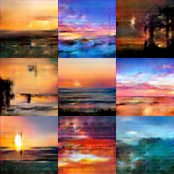

# Sunset GANs
Experimenting with implementing and training GANs to produce fake photos of sunsets.

This repository contains an implementation for a standard DC-GAN (Deep Convolutional GAN) as well as a MSG-GAN (Multi-scale Gradient GAN).

This project was a good learning experience that taught me about GANs and how to best determine the hyperparameters needed to tune them especially since the training process is quite finicky.

DC-GAN produced the following images:

MSG-GAN produced the following images:

The DC-GAN produced fairly realistic images however they were quite low resolution. Hence, I had decided to use a MSG-GAN to produce higher resolution images since they are known to produce state-of-the-art high res photos. 

The lack of computational power meant I could only train the MSG-GAN with a batch size of 4 and for a limited number of epochs. Further training and tuning of hyperparameters could potentially improve the quality of the images. The DC-GAN could also be re-trained to produce higher resolution images.

Overall, this was an interesting learning experience and further work and training could be done to produce higher quality photos. A major limiting factor was the lack of computational power and GPUs.